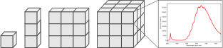

.. _HyperSpy: https://hyperspy.org
.. |HyperSpy| replace:: **HyperSpy** 

.. _introduction:

Introduction
************

What is LumiSpy
===============

**LumiSpy** is an open-source python library aimed at helping with the analysis
of luminescence spectroscopy data. The development started mainly with
photoluminescence (PL), cathodoluminescence (CL), electroluminescence (EL) and
Raman spectroscopy in mind. Besides the standard continuous-excitation spectral
data, the idea is to provide tools also for the analysis of time-resolved
(transient) measurements. However, LumiSpy may prove useful also for other optical
measurements, such as absorption or transmission spectroscopy, scanning optical
near field miscroscopy (SNOM), as well as fourier-transform infrared
spectroscopy (FTIR).

**LumiSpy** is an extension to the python package |HyperSpy|_
that facilitates hyperspectral data analysis, i.e. maps or linescans where a
spectrum is collected at each pixel. Or more general, multidimensional datasets
that can be described as multidimensional arrays of a given signal, as illustrated
by the following figure:

To facilitate working with these datasets, HyperSpy distinguishes between
:external+hyperspy:ref:`navigation and signal dimensions <navigation-signal-dimensions>`
that can be addressed separately and thus, for example, operations on a single
spectrum can be easily mapped to a whole dataset.

Notable features that **HyperSpy** provides are:

- :external+hyperspy:ref:`base signal classes <signal-label>`
  for the handling of (multidimensional) spectral data,
- the necessary tools for  :external+hyperspy:ref:`loading <io>`
  :external+rsciio:ref:`various data file formats <supported-formats>` using the
  library `RosettaSciIO <https://hyperspy.org/rosettasciio>`_,
- :external+hyperspy:ref:`analytical tools <signal1D-label>`
  that exploit the multidimensionality of datasets,
- a user-friendly and powerful framework for :external+hyperspy:ref:`model fitting
  <model-label>` that provides many :external+hyperspy:ref:`standard functions
  <model_components-label>` and can be easily extended to
  :external+hyperspy:ref:`custom ones <expression_component-label>`,
- :external+hyperspy:ref:`machine learning <ml-label>`
  algorithms that can be useful, e.g. for denoising data,
- efficient handling of :external+hyperspy:ref:`big datasets <big-data-label>`,
- functions for :external+hyperspy:ref:`data visualization  <visualization-label>`
  both to evaluate datasets during the analysis and provide interactive
  operation for certain functions, as well as for plotting of data,
- extracting subsets of data from multidimensional datasets via 
  :external+hyperspy:ref:`regions of interest <roi-label>` and a powerful
  numpy-style :external+hyperspy:ref:`indexing mechanism <signal.indexing>`,
- handling of :external+hyperspy:ref:`non-uniform data axes <Axes_types>`
  (introduced in the :external+hyperspy:ref:`1.7.0 release 
  <changes_1.7.0>`).

**LumiSpy** provides in particular:

- additional :ref:`signal_types` specifically for luminescence spectra and
  transients,
- transformation to :ref:`non-uniform signal axes <signal_axis>` for use of other
  common units, such as eV (electron volt) and wavenumbers (Raman shift),
- additional :ref:`signal tools <signal_tools>` such as data normalization and scaling,
- various :ref:`utility functions <utilities>` useful in luminescence spectroscopy
  data analysis, such as joining multiple spectra along the signal axis, 
  unit conversion, etc.

**LumiSpy** should facilitate an easy and reproducible analysis of single
spectra or spectral images.

.. _signal_types:

Signal types
============

As an extension to HyperSpy, LumiSpy provides several signal types extending the
:external+hyperspy:ref:`base classes available in HyperSpy
<signal_subclasses_table-label>`. When the LumiSpy library is installed, these
additional signal types are directly available to HyperSpy. To print all available
specialised :external:class:`hyperspy.signal.BaseSignal` subclasses installed
in your system call the :external:func:`hyperspy.api.print_known_signal_types`
function:

.. code-block:: python

    >>> import hyperspy.api as hs
    >>> hs.print_known_signal_types()

The different subclasses are characterized by the ``signal_type`` metadata
attribute. Some additional properties are summarized in the table below.
Depending on the use case, certain functions will only be available for some
signal types (or inheriting) signal types.

.. _lumispy_subclasses_table:

.. table:: LumiSpy subclasses and their basic attributes.

    +----------------------------------------------------------------------+------------------+---------------+---------+---------------------------------------------------------------------------+
    |  BaseSignal subclass                                                 | signal_dimension |  signal_type  |  dtype  |  aliases                                                                  |
    +======================================================================+==================+===============+=========+===========================================================================+
    |  :class:`~.signals.luminescence_spectrum.LumiSpectrum`               |        1         |  Luminescence |  real   | LumiSpectrum, LuminescenceSpectrum                                        |
    +----------------------------------------------------------------------+------------------+---------------+---------+---------------------------------------------------------------------------+
    |  :class:`~.signals.cl_spectrum.CLSpectrum`                           |        1         |       CL      |  real   | CLSpectrum, cathodoluminescence                                           |
    +----------------------------------------------------------------------+------------------+---------------+---------+---------------------------------------------------------------------------+
    |  :class:`~.signals.cl_spectrum.CLSEMSpectrum`                        |        1         |     CL_SEM    |  real   | CLSEM, cathodoluminescence SEM                                            |
    +----------------------------------------------------------------------+------------------+---------------+---------+---------------------------------------------------------------------------+
    |  :class:`~.signals.cl_spectrum.CLSTEMSpectrum`                       |        1         |    CL_STEM    |  real   | CLSTEM, cathodoluminescence STEM                                          |
    +----------------------------------------------------------------------+------------------+---------------+---------+---------------------------------------------------------------------------+
    |  :class:`~.signals.el_spectrum.ELSpectrum`                           |        1         |       EL      |  real   | ELSpectrum, electroluminescence                                           |
    +----------------------------------------------------------------------+------------------+---------------+---------+---------------------------------------------------------------------------+
    |  :class:`~.signals.pl_spectrum.PLSpectrum`                           |        1         |       PL      |  real   | PLSpectrum, photoluminescence                                             |
    +----------------------------------------------------------------------+------------------+---------------+---------+---------------------------------------------------------------------------+
    |  :class:`~.signals.luminescence_transient.LumiTransient`             |        1         |   Transient   |  real   | TRLumi, TR luminescence, time-resolved luminescence                       |
    +----------------------------------------------------------------------+------------------+---------------+---------+---------------------------------------------------------------------------+
    |  :class:`~.signals.luminescence_transientspec.LumiTransientSpectrum` |        2         | TransientSpec |  real   | TRLumiSpec, TR luminescence spectrum, time-resolved luminescence spectrum |
    +----------------------------------------------------------------------+------------------+---------------+---------+---------------------------------------------------------------------------+

The hierarchy of the LumiSpy signal types and their inheritance from HyperSpy
is summarized in the following diagram:

|   └── :external:class:`hyperspy.signal.BaseSignal`
|           ├── :external:class:`hyperspy._signals.signal1d.Signal1D`
|           │       └── :class:`~.signals.luminescence_spectrum.LumiSpectrum`
|           │       │       ├── :class:`~.signals.cl_spectrum.CLSpectrum`
|           │       │       │       ├── :class:`~.signals.cl_spectrum.CLSEMSpectrum` 
|           │       │       │       └── :class:`~.signals.cl_spectrum.CLSTEMSpectrum` 
|           │       │       ├── :class:`~.signals.el_spectrum.ELSpectsrum`
|           │       │       └── :class:`~.signals.pl_spectrum.PLSpectrum`
|           │       └── :class:`~.signals.luminescence_transient.LumiTransient`
|           └── :class:`hyperspy.signal.Signal2D`
|                   └── :class:`~.signals.luminescence_transientspec.LumiTransientSpectrum`
|
|

Where are we heading?
=====================

LumiSpy is under active development, and as a user-driven project, we welcome
:ref:`contributions <contributing_label>` to the code and documentation,
but also bug reports and feature requests from any user. Don't hesitate
to join the discussions!

Currrently, we have implemented the base functionality that extends 
:external+hyperspy:ref:`HyperSpy's capabilities <user_guide>`
to additional signal classes. In the near future, the following functions
should be developed:

- handling of transient (time-resolved) data with dedicated models,
- extend the capabilities for reading relevant data formats
  (see :external+rsciio:ref:`supported-formats` of RosettaSciIO),
- more dedicated analysis functionalities,
- ...
