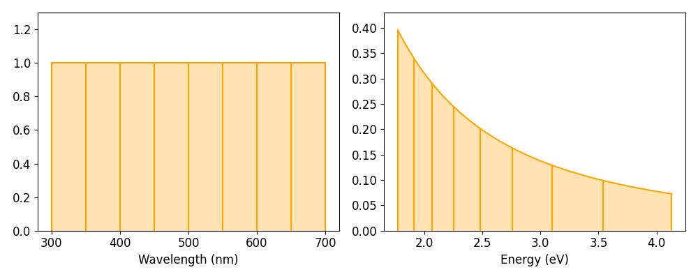

.. _signal_axis:

Non-uniform signal axes
***********************

LumiSpy facilitates the use of :external+hyperspy:ref:`non-uniform axes <data-axis>`,
where the points of the axis vector are not uniformly spaced. This situation
occurs in particular when converting a wavelength scale to energy (eV) or
wavenumbers (e.g. for Raman shifts).

The conversion of the signal axis can be performed using the functions 
:meth:`~.signals.luminescence_spectrum.LumiSpectrum.to_eV`,
:meth:`~.signals.luminescence_spectrum.LumiSpectrum.to_invcm` and
:meth:`~.signals.luminescence_spectrum.LumiSpectrum.to_raman_shift`
(alias for :meth:`~.signals.luminescence_spectrum.LumiSpectrum.to_invcm_relative`).
If the unit of the signal axis is set, the functions can handle wavelengths in
either nm or µm.

Accepted parameters are ``inplace=True/False`` (default is True), which
determines whether the current signal object is modified or a new one is
created, and ``jacobian=True/False`` (default is True, see
:ref:`jacobian`).

.. _energy_axis:

The energy axis
===============

The transformation from wavelength :math:`\lambda` to energy :math:`E` is
defined as :math:`E = h c/ \lambda`. Taking into account the refractive index of
air and doing a conversion from nm to eV, we get:

.. math::

    E[eV] = \frac{10^9}{e}\frac{h c}{n_{air} \lambda[nm]},

where :math:`h` is the Planck constant, :math:`c` is the speed of light,
:math:`e` is the elementary charge and :math:`n_{air}` is the refractive
index of air, see also [Pfueller]_.

.. code-block:: python

    >>> s2 = s.to_eV(inplace=False)
    >>> s.to_eV()

.. Note::

    The refractive index of air :math:`n_{air}` is wavelength
    dependent. This dependence is taken into account by LumiSpy based on the
    analytical formula given by [Peck]_ valid from 185-1700 nm
    (outside of this range, the values of the refractive index at the edges of
    the range are used and a warning is raised).

.. _wavenumber_axis:

The wavenumber axis/Raman shifts
================================

The transformation from wavelength :math:`\lambda` to wavenumber
:math:`\tilde{\nu}` (spatial frequency of the wave) is defined as
:math:`\tilde{\nu} = 1/ \lambda`. The wavenumber is usually given in units of
:math:`\mathrm{cm}^{-1}`.

When converting a signal to Raman shift, i.e. the shift in wavenumbers from
the exciting laser wavelength, the laser wavelength has to be passed to the function using the parameter
``laser`` using the same units as for the original axis (e.g. 325 for nm or
0.325 for µm) unless it is contained in the :ref:`metadata_structure` under
``Acquisition_instrument.Laser.wavelength``.

TODO: Automatically read laser wavelength from metadata if given there.

.. code-block:: python

    >>> s2 = s.to_invcm(inplace=False)
    >>> s.to_invcm()
    >>> s2 = s.to_raman_shift(inplace=False, laser=325)
    >>> s.to_raman_shift(laser=325)

.. _jacobian:

Jacobian transformation
=======================

When transforming the signal axis, the signal intensity is automatically
rescaled (Jacobian transformation), unless the ``jacobian=False`` option is
given. Only converting the signal axis, and leaving the signal intensity
unchanged, would implie that the integral of the signal over the same interval
leads to different results depending on the quantity on the axis (see e.g.
[Mooney]_ and [Wang]_).

For the energy axis as example, if we require :math:`I(E)dE = I(\lambda)d\lambda`,
then :math:`E=hc/\lambda` implies

.. math ::

    I(E) = I(\lambda)\frac{d\lambda}{dE} = I(\lambda)\frac{d}{dE}
    \frac{h c}{E} = - I(\lambda) \frac{h c}{E^2}

The minus sign just reflects the different directions of integration in
the wavelength and energy domains. The same argument holds for the conversion
from wavelength to wavenumber (just without the additional prefactors in the
equation). The renormalization in LumiSpy is defined such that the intensity is
converted from counts/nm (or counts/µm) to counts/meV. The following
figure illustrates the effect of the Jacobian transformation:

.. _jacobian_variance:

Transformation of the variance
------------------------------

Scaling the signal intensities implies that also the stored variance of the
signal needs to be scaled accordingly. According to :math:`Var(aX) = a^2Var(X)`,
the variance has to be multiplied with the square of the Jacobian. This squared
renormalization is automatically performed by LumiSpy if ``jacobian=True``.
In particular, homoscedastic (constant) noise will consequently become
heteroscedastic (changing as a function of the signal axis vector). Therefore,
if the ``metadata.Signal.Noise_properties.variance`` attribute is a constant,
it is converted into a :external:class:`hyperspy.api.signals.BaseSignal` object
before the transformation.

See the section on :ref:`fitting_variance` for more general information on data variance
in the context of model fitting and the HyperSpy documentation on `
:external+hyperspy:ref:`setting the noise properties <signal.noise_properties>`.

.. Note::

    If the Jacobian transformation is performed, the values of
    ``metadata.Signal.Noise_properties.Variance_linear_model`` are reset to
    their default values (``gain_factor=1``, ``gain_offset=0`` and ``correlation_factor=1``).
    Should these values deviate from the defaults, make sure to run
    :external:meth:`hyperspy.api.signals.BaseSignal.estimate_poissonian_noise_variance`
    prior to the transformation.

