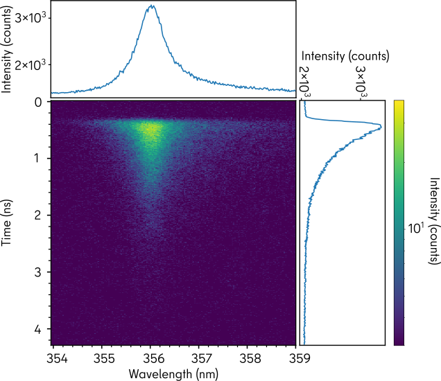

.. _streak_images:

Working with streak images
**************************

LumiSpy has implemented handling of streak camera images, which are a special
subclass of :class:`hyperspy.api.signals.Signal2D` as the two signal axes have
different units: Namely, wavelength (or energy) and time. The signal class is 
:class:`~.signals.luminescence_transientspec.LumiTransientSpectrum`. An important
feature is that also for streak camera images (or linescans/maps of these), the
wavelength axis can be transformed to e.g. a :ref:`energy_axis`.

.. Note::

    For streak images, not all tools available for :class:`hyperspy.api.signals.Signal2D`
    will work. However, in particular
    :external+hyperspy:ref:`peak_finding-label`
    can be helpful to identify local maxima in the images.

Transition to one-dimensional signals
=====================================

When transitioning from a streak image to a one-dimensional signal, LumiSpy
uses the axes units of the new signal (whether it is time units or not) to
assign the correct 1D signal class: Either :class:`~.signals.luminescence_spectrum.LumiSpectrum` or
:class:`~.signals.luminescence_transient.LumiTransient`. Such a reduction of the signal dimensionality
can be done for example by slicing the signal with
:external+hyperspy:ref:`numpy-style indexing <signal.indexing>` or by using
functions such as :external:meth:`~hyperspy.api.signals.BaseSignal.sum`
and :external:meth:`~hyperspy.api.signals.BaseSignal.integrate1D`

In the following image, the spectrum summed over all times is obtained from the
streak image by:

.. code-block:: python

    >>> import lumispy as lum
    >>> import numpy as np
    ...
    >>> data = np.arange(10*20).reshape(10, 20)
    >>> ax0 = {"name": "Time", "units": "ps", "size": 10}
    >>> ax1 = {"name": "Wavelength", "units": "nm", "size": 20}
    >>> s = lum.signals.LumiTransientSpectrum(data, axes = [ax0, ax1])
    ...
    >>> s.sum(axis='Time')
    >>> # Or alternatively:
    >>> s.sum(axis=-1)
    <LumiSpectrum, title: , dimensions: (|20)>

Similarly, the transient summed over all wavelengths is obtained by:

.. code-block:: python

    >>> s.sum(axis='Wavelength')
    >>> # Or alternatively:
    >>> s.sum(axis=-2)
    <LumiTransient, title: , dimensions: (|10)>

The following image shows the plot of a streak camera image and its one-dimensional
representations obtained by summing over either the wavelength or time dimensions:

        obtained by summing over either the wavelength or time dimensions.

Iteration over the spectral or time dimension
=============================================

When performing an analysis where the same methods (e.g. a model fit) should be applied
at every spectral position or at every time, it is convenient and more efficient
to iterate over the corresponding axis. Therefore, this axis should be converted
from a ``signal`` to a ``navigation`` dimension. To this end, the 
:class:`~.signals.luminescence_transientspec.LumiTransientSpectrum`
class provides the functions :meth:`~.signals.luminescence_transientspec.LumiTransientSpectrum.spec2nav`
and :meth:`~.signals.luminescence_transientspec.LumiTransientSpectrum.time2nav`
to convert streak images to the :class:`~.signals.luminescence_transient.LumiTransient`
and :class:`~.signals.luminescence_spectrum.LumiSpectrum` classes, respectively.
Both functions return a new signal. By default (``optimize=True``), the methods ensure that the data
is stored optimally, hence often making a copy of the data.

.. code-block:: python

    >>> import lumispy as lum
    >>> import numpy as np
    ...
    >>> data = np.ones(100).reshape(10, 10)
    >>> ax0 = {"name": "Time", "units": "ps", "size": 10}
    >>> ax1 = {"name": "Wavelength", "units": "nm", "size": 10}
    >>> s = lum.signals.LumiTransientSpectrum(data, axes = [ax0, ax1])
    ...
    >>> s
    <LumiTransientSpectrum, title: , dimensions: (|10, 10)>
    >>> s.spec2nav()
    <LumiTransient, title: , dimensions: (10|10)>
    >>> s.time2nav()
    <LumiSpectrum, title: , dimensions: (10|10)>

.. Note::

    In case of existing navigation axes (e.g. linescan or map of streak images),
    the new axis is added as first axis:
    
    .. code-block:: python
    
        >>> data = np.ones(1000).reshape(10, 10, 10)
        >>> ax0 = {"name": "Position", "units": "px", "size": 10}
        >>> ax1 = {"name": "Time", "units": "ps", "size": 10}
        >>> ax2 = {"name": "Wavelength", "units": "nm", "size": 10}
        >>> s = lum.signals.LumiTransientSpectrum(data, axes= [ax0, ax1, ax2])
        ...
        >>> s.axes_manager[0]
        <Position axis, size: 10, index: 0>
        >>> s.time2nav().axes_manager[0]
        <Time axis, size: 10, index: 0>
